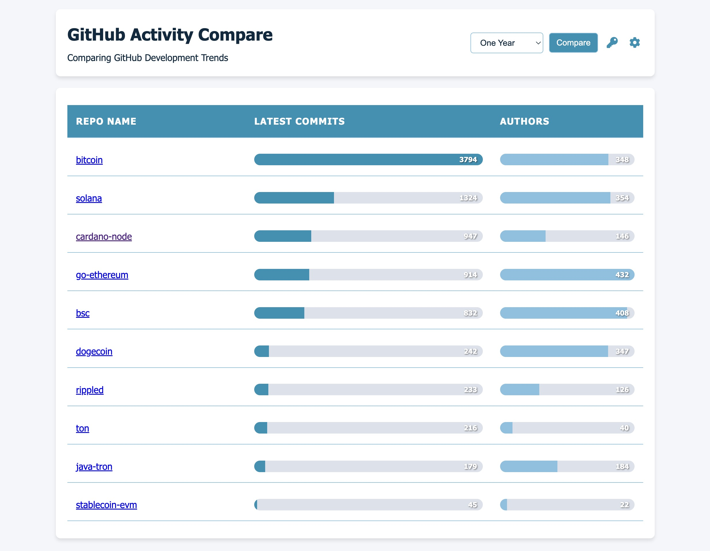

# MultiRepoCompare

MultiRepoCompare is a web-based tool that allows you to compare the development activity of multiple GitHub repositories. It provides a visual representation of commit activity and contributor count for selected repositories over a specified time range.



## Features

- Compare multiple GitHub repositories side by side
- Visualize commit activity and contributor count
- Customize time range for comparison (1 week to all-time)
- Easy-to-use interface with responsive design
- Secure storage of GitHub access token in local storage
- Configurable repository list

## Demo

You can try out the live demo of MultiRepoCompare [here](https://MultiRepoCompare.vercel.app).

## Installation

1. Clone the repository:
   ```
   git clone https://github.com/healthsgood/MultiRepoCompare.git
   ```

2. Navigate to the project directory:
   ```
   cd MultiRepoCompare
   ```

3. Open `index.html` in a web browser.

   Note: Due to CORS restrictions, you may need to run the project on a local web server. You can use tools like [Live Server](https://marketplace.visualstudio.com/items?itemName=ritwickdey.LiveServer) for Visual Studio Code or Python's `http.server` module.

## Usage

1. When you first open the application, you'll be asked to enter the list of repositories you want to compare. Enter each repository in the format `username/repository`, one per line.

2. Next, you'll be prompted to enter your GitHub Personal Access Token. This is required to make API calls to GitHub.

3. Select the time range for comparison from the dropdown menu.

4. Click the "Compare" button to generate the comparison.

5. The results will be displayed in a table, showing the commit activity and contributor count for each repository.

## Configuration

- To change the GitHub Access Token: Click the key icon in the top right corner.
- To modify the list of repositories: Click the gear icon in the top right corner.

## License

This project is licensed under the MIT License - see the [LICENSE.md](LICENSE.md) file for details.

## Contact

If you have any questions, feel free to reach out to [healthsgood@outlook.com](mailto:healthsgood@outlook.com).

---

Made with ❤️ by [healthsgood]